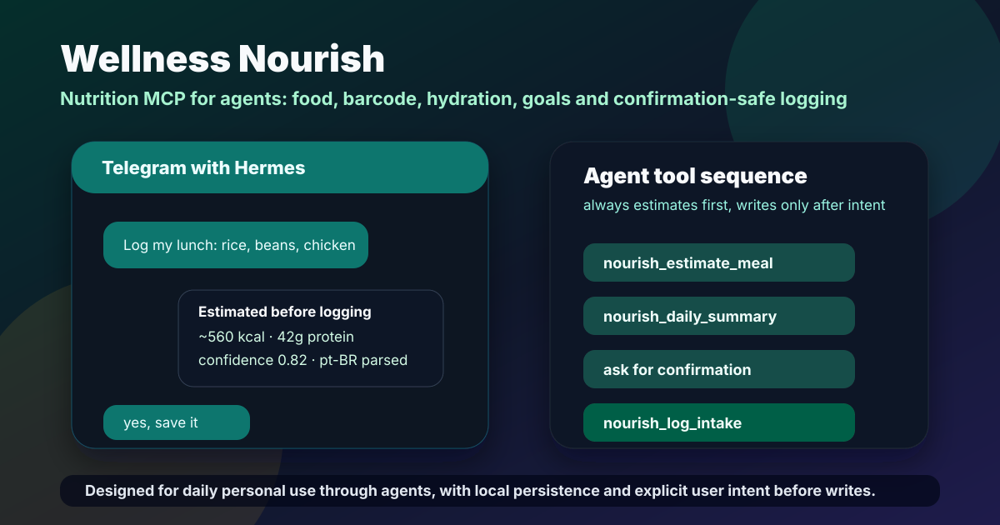

<!-- delx-wellness header v2 -->
<h1 align="center">Wellness Nourish</h1>

<div align="center">
  
</div>

<h3 align="center">
  Local-first nutrition MCP &mdash; food search, barcode lookup, intake logging, hydration. Works without OAuth.<br>
  Local-first MCP server &mdash; <strong>tokens never leave your machine</strong>.
</h3>

<p align="center">
  <a href="https://www.npmjs.com/package/wellness-nourish"></a>
  <a href="https://www.npmjs.com/package/wellness-nourish"></a>
  <a href="LICENSE"></a>
  <a href="https://wellness.delx.ai/nutrition"></a>
</p>

<p align="center">
  <a href="https://github.com/davidmosiah/wellness-nourish/stargazers"></a>
  <a href="https://modelcontextprotocol.io"></a>
  <a href="https://github.com/davidmosiah/delx-wellness-hermes"></a>
  <a href="https://github.com/davidmosiah/delx-wellness-openclaw"></a>
  <a href="https://github.com/davidmosiah/delx-wellness"></a>
</p>

<p align="center">
  <strong>📈 Active in the wild: <a href="https://www.npmjs.com/package/wellness-nourish">~500 npm downloads/day</a> across AI agents and MCP clients.</strong><br>
  <sub>If Nourish helps your agent, a ⭐ on this repo makes it easier for other AI builders to find.</sub>
</p>

> ⚡ **One-command install** &mdash; pick your runtime:
> - [Delx Wellness for Hermes](https://github.com/davidmosiah/delx-wellness-hermes): `npx -y delx-wellness-hermes setup`
> - [Delx Wellness for OpenClaw](https://github.com/davidmosiah/delx-wellness-openclaw): `npx -y delx-wellness-openclaw setup`
>
> Both preconfigure this connector and the full Delx Wellness stack into a dedicated profile. Or wire it standalone into Claude Desktop / Cursor / ChatGPT Desktop &mdash; see the install section below.

---

<!-- /delx-wellness header v2 -->

## Overview

Wellness Nourish is a local MCP server for nutrition search, barcode lookup, barcode photo lookup, photo-assisted meal estimation, intake logging, hydration, goals, exports, daily or weekly summaries, personal meal memory, and coach-style nutrition workflows. It runs over stdio by default for MCP clients and can also run a Streamable HTTP endpoint at `POST /mcp`.

> If this nutrition layer helps your agent workflow, please star the repo. Stars make the project easier for other AI builders to discover and help Delx keep shipping local-first wellness infrastructure.

<p align="center">
  
</p>

## Try It In 60 Seconds

```bash
npx -y wellness-nourish doctor
npx -y wellness-nourish search banana
npx -y wellness-nourish log --preview "2 ovos, banana e café preto"
```

For the full Telegram/Hermes flow:

```bash
npx -y delx-wellness-hermes setup
hermes -p delx-wellness
```

The connector uses USDA FoodData Central as the primary food search provider. Open Food Facts is used for packaged-food barcode lookup and product-name search when enabled. Local barcode image decoding is supported with ZXing. Meal photos are estimated only from an agent-provided visual observation and always require confirmation before logging. The local estimator includes a pt-BR/Brazilian-food catalog for common meals, kitchen units, and shortcuts such as arroz, feijão, frango, ovos, banana, tapioca, picanha, feijoada and salada. It does not provide hosted sync, autonomous photo upload, recipe generation, or medical advice.

## Install

```bash
npm install
npm run build
```

Run the MCP server over stdio:

```bash
npm start
```

Run Streamable HTTP locally:

```bash
node dist/index.js --http
```

Optional environment:

```bash
FDC_API_KEY=your_usda_key
NOURISH_OFF_ENABLED=1
NOURISH_LOCAL_DIR=~/.wellness-nourish
NOURISH_MCP_PORT=3000
```

Agents should never ask users to paste API keys, tokens, raw health exports, or private food logs into chat. Configure secrets through environment variables or local files.

## CLI Commands

```bash
wellness-nourish status
wellness-nourish doctor
wellness-nourish setup --client claude
wellness-nourish search banana
wellness-nourish barcode 0000000000000
wellness-nourish log --preview --meal breakfast "2 eggs and banana"
wellness-nourish log "2 eggs and banana"
wellness-nourish list 2026-05-05
wellness-nourish edit --entry intake_id --meal snack --notes "corrected"
wellness-nourish today --format markdown
wellness-nourish weekly --format markdown
wellness-nourish goals --set-calories 2200 --set-protein 120 --set-water 2500
wellness-nourish water 500 --date 2026-05-05
wellness-nourish water today --date 2026-05-05
wellness-nourish export --format csv
wellness-nourish clear-day 2026-05-05 --yes
wellness-nourish delete --entry intake_id
```

No arguments start the stdio MCP server. `--http` starts HTTP transport, `--version` prints the package version, and `--help` prints usage.

`log --preview` estimates without writing. Mutating MCP tools require explicit user intent; CLI commands are treated as explicit user actions, while destructive clear-day requires `--yes`.

The local estimator understands common lightweight portions such as `g`, `oz`, `cup`, `tbsp`, `tsp`, `slice`, `piece`, and `serving`. It still reports confidence and warnings because these are conservative tracking estimates, not lab-grade nutrition facts.

## MCP Client Config Examples

Ready-to-use examples live in `examples/`:

- `examples/claude-desktop.json`
- `examples/codex.json`
- `examples/cursor.json`
- `examples/windsurf.json`
- `examples/hermes.md`
- `examples/hermes-skill.md`
- `examples/openclaw.md`

Claude Desktop style:

```json
{
  "mcpServers": {
    "nourish": {
      "command": "npx",
      "args": ["-y", "wellness-nourish"],
      "env": {
        "FDC_API_KEY": "${FDC_API_KEY}",
        "NOURISH_OFF_ENABLED": "1"
      }
    }
  }
}
```

## Hermes / Telegram Personal Setup

For a personal Hermes server connected to your Telegram bot, let the package write the Hermes config and skill:

```bash
npx -y wellness-nourish setup --client hermes --profile david --local-dir /root/.hermes/nourish/david
npx -y wellness-nourish doctor --client hermes --json
hermes mcp test nourish
```

This adds a `nourish` MCP server block to `~/.hermes/config.yaml`, installs `~/.hermes/skills/nourish-mcp/SKILL.md`, and pins the npm package version. After config changes, use `/reload-mcp` or `hermes mcp test nourish`.

Hermes setup also writes `~/.hermes/scripts/nourish-mcp-wrapper.sh`. The wrapper sources `~/.hermes/secrets/nourish.env` when present, so `FDC_API_KEY` can be managed as a server-side secret without pasting it into chat or relying on a stale shell session.

Recommended Telegram flow:

1. User says what they ate.
2. Hermes calls `nourish_estimate_meal` and replies with calories, protein, confidence and warnings.
3. For barcode photos, Hermes calls `nourish_lookup_barcode_image` when it has an image path, base64 image, or data URI.
4. For mixed food photos, Hermes calls `nourish_analyze_food_image` with barcode observations, label OCR, detected items, or image description.
5. For meal photos, Hermes describes visible food and portions, calls `nourish_estimate_meal_photo`, and asks for portion confirmation.
6. For "what should I eat now?" questions, Hermes calls `nourish_daily_coach` or `nourish_suggest_next_meal`, optionally passing wearable context from WHOOP/Garmin/Oura.
7. For repeated meals, Hermes can call `nourish_remember_meal` after explicit user intent so future phrases like "meu café normal" expand locally.
8. User confirms saving.
9. Hermes calls `nourish_log_intake` with `explicit_user_intent: true`.
10. User can ask for `today`, weekly summaries, goals, hydration, edits, deletes or exports.

Local build:

```json
{
  "mcpServers": {
    "nourish": {
      "command": "node",
      "args": ["/absolute/path/to/wellness-nourish/dist/index.js"],
      "env": {
        "NOURISH_LOCAL_DIR": "/absolute/path/to/.wellness-nourish"
      }
    }
  }
}
```

## Provider Attribution

USDA FoodData Central is the primary provider for generic food search and nutrient data. USDA data is public domain or otherwise provided by USDA FoodData Central terms; keep provider attribution with derived results.

Open Food Facts barcode data is licensed under the Open Database License (ODbL). Open Food Facts metadata has share-alike obligations, so agents and downstream tools should preserve attribution and license metadata when exporting or reusing packaged-food records.

## Privacy

Intake data is stored locally under `~/.wellness-nourish/intake.jsonl` unless `NOURISH_LOCAL_DIR` is set. Hydration is stored in `hydration.jsonl`, and goals are stored in `goals.json` in the same local directory. The connector does not require hosted accounts and does not send local intake logs to Delx Wellness. Provider lookups may contact USDA FoodData Central or Open Food Facts unless fixture mode is enabled.

Use `nourish-mcp export` to print the local JSONL export, `nourish-mcp export --format csv` for CSV, `nourish-mcp delete --entry <id>` to delete a specific intake entry, or `nourish-mcp clear-day <date> --yes` to delete all intake entries for a day.

## Not Medical Advice

Nutrition estimates are approximate and intended for personal tracking and agent workflow context. They are not diagnosis, treatment, or medical advice. Confirm important nutrition decisions with a qualified professional.

## Development And Tests

```bash
npm run typecheck
npm run build
npm run smoke:http
npm run test:cli-ux
npm run test:agent-readiness
npm test
```

Fixture mode:

```bash
NOURISH_FIXTURE_MODE=1 NOURISH_FIXTURE_DIR=fixtures npm run test:cli-ux
```

## Delx Wellness

Project page: <https://wellness.delx.ai/nutrition>

<!-- delx-wellness see-also -->

## See also

The full [Delx Wellness](https://wellness.delx.ai) connector library:

| Provider | Package | Repo |
|---|---|---|
| WHOOP | [`whoop-mcp-unofficial`](https://www.npmjs.com/package/whoop-mcp-unofficial) | [whoop-mcp](https://github.com/davidmosiah/whoop-mcp) |
| Oura | [`oura-mcp-unofficial`](https://www.npmjs.com/package/oura-mcp-unofficial) | [ouramcp](https://github.com/davidmosiah/ouramcp) |
| Garmin | [`garmin-mcp-unofficial`](https://www.npmjs.com/package/garmin-mcp-unofficial) | [garminmcp](https://github.com/davidmosiah/garminmcp) |
| Strava | [`strava-mcp-unofficial`](https://www.npmjs.com/package/strava-mcp-unofficial) | [strava-mcp](https://github.com/davidmosiah/strava-mcp) |
| Fitbit | [`fitbit-mcp-unofficial`](https://www.npmjs.com/package/fitbit-mcp-unofficial) | [fitbitmcp](https://github.com/davidmosiah/fitbitmcp) |
| Google Health | [`google-health-mcp-unofficial`](https://www.npmjs.com/package/google-health-mcp-unofficial) | [google-health-mcp](https://github.com/davidmosiah/google-health-mcp) |
| Withings | [`withings-mcp-unofficial`](https://www.npmjs.com/package/withings-mcp-unofficial) | [withingsmcp](https://github.com/davidmosiah/withingsmcp) |
| Apple Health | [`apple-health-mcp-unofficial`](https://www.npmjs.com/package/apple-health-mcp-unofficial) | [apple-health-mcp](https://github.com/davidmosiah/apple-health-mcp) |
| Samsung Health | [`samsung-health-mcp-unofficial`](https://www.npmjs.com/package/samsung-health-mcp-unofficial) | [samsung-health-mcp](https://github.com/davidmosiah/samsung-health-mcp) |
| Polar | [`polar-mcp-unofficial`](https://www.npmjs.com/package/polar-mcp-unofficial) | [polarmcp](https://github.com/davidmosiah/polarmcp) |
| Nourish (nutrition) | [`wellness-nourish`](https://www.npmjs.com/package/wellness-nourish) | [wellness-nourish](https://github.com/davidmosiah/wellness-nourish) |

**One-command setup for Hermes** — preconfigures every connector above plus wellness skills + onboarding: [`delx-wellness-hermes`](https://github.com/davidmosiah/delx-wellness-hermes).

<!-- /delx-wellness see-also -->
