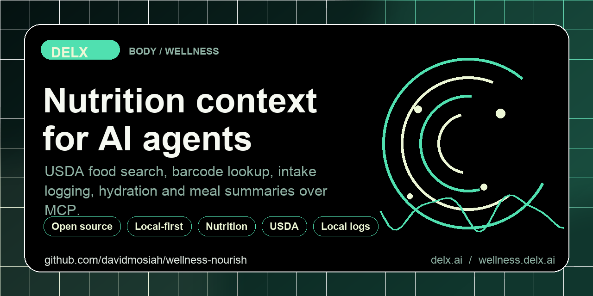
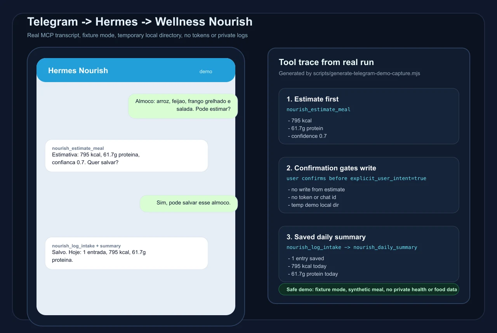

[](https://mseep.ai/app/davidmosiah-wellness-nourish)

<!-- delx-wellness header v2 -->
<h1 align="center">Wellness Nourish</h1>

<div align="center">
  
</div>

<h3 align="center">
  Local-first nutrition MCP &mdash; food search, barcode lookup, intake logging, hydration. Works without OAuth.<br>
  Local-first MCP server &mdash; <strong>tokens never leave your machine</strong>.
</h3>

<p align="center">
  <a href="https://www.npmjs.com/package/wellness-nourish"></a>
  <a href="https://github.com/davidmosiah/wellness-nourish/releases/latest"></a>
  <a href="https://www.npmjs.com/package/wellness-nourish"></a>
  <a href="LICENSE"></a>
  <a href="https://wellness.delx.ai/nutrition"></a>
</p>

<p align="center">
  <a href="https://github.com/davidmosiah/wellness-nourish/stargazers"></a>
  <a href="https://modelcontextprotocol.io"></a>
  <a href="https://github.com/davidmosiah/delx-wellness/blob/main/docs/release-index.md"></a>
  <a href="https://github.com/davidmosiah/delx-wellness-hermes"></a>
  <a href="https://github.com/davidmosiah/delx-wellness-openclaw"></a>
  <a href="https://github.com/davidmosiah/delx-wellness"></a>
</p>

<p align="center">
  <strong>📈 Published on npm and used by AI agents and MCP clients</strong> &mdash; see the live <a href="https://www.npmjs.com/package/wellness-nourish">download badge</a> above for current numbers.<br>
  <sub>If Nourish helps your agent, a ⭐ on this repo makes it easier for other AI builders to find.</sub>
</p>

> ⚡ **One-command install** &mdash; pick your runtime:
> - [Delx Wellness for Hermes](https://github.com/davidmosiah/delx-wellness-hermes): `npx -y delx-wellness-hermes setup`
> - [Delx Wellness for OpenClaw](https://github.com/davidmosiah/delx-wellness-openclaw): `npx -y delx-wellness-openclaw setup`
>
> Both preconfigure this connector and the full Delx Wellness stack into a dedicated profile. Or wire it standalone into Claude Desktop / Cursor / ChatGPT Desktop &mdash; see the install section below.
>
> Want runnable agent examples? Use the [Delx Agent Workbench](https://github.com/davidmosiah/delx-agent-workbench) for prompt packs, MCP client configs and local-first workflow templates.

> **Public proof:** Nourish is tracked in the Delx [Open Source Growth Snapshot](https://github.com/davidmosiah/delx-wellness/blob/main/docs/open-source-growth-snapshot.md) alongside downloads, stars and next-action priorities. If this saves you setup time, star this repo so other agent builders can find the local-first nutrition path faster.

---

<!-- /delx-wellness header v2 -->

Local-first nutrition MCP for AI agents — food search, barcode lookup, photo-assisted meal estimation, intake logging, hydration, goals and coach-style workflows. No OAuth, no hosted account.

## Front door

- **Install one connector** — `npx -y wellness-nourish setup --client claude`
- **Run it in** Claude · Cursor · ChatGPT · Hermes · OpenClaw — see the [client examples](https://github.com/davidmosiah/delx-wellness#run-it-in-your-agent).
- **Local-first** — your tokens and food logs never leave your machine ([privacy](#privacy--what-runs-offline)).
- **Which connector should I use?** — see the [front-door guide](https://github.com/davidmosiah/delx-wellness#which-connector-should-i-use).

## Quickstart (60 seconds)

```bash
npx -y wellness-nourish doctor
npx -y wellness-nourish search banana
npx -y wellness-nourish barcode 0000000000000
npx -y wellness-nourish log --preview "2 ovos, banana e café preto"
```

`doctor` checks readiness, `search`/`barcode` hit the food providers, and `log --preview` estimates a meal locally without writing anything.

### Zero-secret demo (offline, no API key)

`NOURISH_FIXTURE_MODE=1` serves the bundled `fixtures/` instead of calling USDA or Open Food Facts, so you can see the exact shape of every response with zero network access or keys:

```bash
$ NOURISH_FIXTURE_MODE=1 wellness-nourish search banana
Bananas, raw	usda	89 kcal/100g
BANANA	usda	312 kcal/100g
```

## Try it with your agent

Three copy-paste prompts, all backed by existing tools:

- "Estimate the calories and protein in 2 eggs, a banana and black coffee." → `nourish_estimate_meal`
- "Look up the barcode 737628064502 and tell me what it is." → `nourish_lookup_barcode`
- "What should I eat next today, given my goals?" → `nourish_daily_coach` / `nourish_suggest_next_meal`

Mutating tools (log intake, water, goals, clear-day) never run without explicit user save intent — they return `USER_ACTION_REQUIRED` until the agent passes `explicit_user_intent: true`.

## Tools

Nourish exposes food search, barcode lookup (text + image), photo-assisted meal estimation, intake logging, hydration, goals, exports, daily/weekly summaries, personal meal memory, and coach-style workflows over stdio (default) or Streamable HTTP (`POST /mcp`).

- **Full CLI (20+ commands), install, client configs & ChatGPT dashboard** → [`docs/cli.md`](docs/cli.md)
- **Hermes / Telegram personal setup (10-step flow)** → [`docs/telegram.md`](docs/telegram.md)
- **Data providers & attribution (USDA, Open Food Facts, ZXing)** → [`docs/providers.md`](docs/providers.md)
- **pt-BR meal-estimator eval set (52 examples)** → [`docs/evals/pt-br-meal-estimator.json`](docs/evals/pt-br-meal-estimator.json)
- **Reproducible Telegram/Hermes demo transcript** → [`docs/telegram-demo-transcript.json`](docs/telegram-demo-transcript.json)

### Food photo decision tree

Agents should route Telegram/Hermes/OpenClaw food photos by the strongest signal they can extract:

1. Barcode is visible and image bytes are available: call `nourish_lookup_barcode_image`.
2. Barcode is blurry or no product is found: ask for sharper barcode digits, or call `nourish_analyze_food_image` with `barcode_observation` plus any OCR/meal clues.
3. Nutrition facts are readable: OCR the label and call `nourish_analyze_food_image` with `product_name` and `nutrition_label_text`.
4. It is a plate or unpackaged food: describe visible foods/portions and call `nourish_analyze_food_image` with `detected_items` or `image_description`.
5. Never log from an image response until the user confirms the product or meal, serving size and save intent.

Image tools accept exactly one of these input forms:

```json
{ "image_path": "/tmp/telegram-food-photo.jpg" }
```

```json
{ "image_base64": "<base64 image bytes>", "image_mime_type": "image/jpeg" }
```

```json
{ "image_data_uri": "data:image/jpeg;base64,<base64 image bytes>" }
```

If barcode decoding fails, the response includes `fallback` and `next_actions` so the agent can ask the user for the typed digits, OCR the nutrition label, or route the photo as a meal without silently inventing a food.

<p align="center">
  
</p>

The capture above is generated from a real MCP run in fixture mode with a temporary local directory:

```bash
npm run demo:capture
```

The committed transcript proves the exact tool sequence: `nourish_estimate_meal` → user confirmation → `nourish_log_intake` → `nourish_daily_summary`.

## Privacy & what runs offline

Intake, hydration and goals are stored locally under `~/.wellness-nourish/` (override with `NOURISH_LOCAL_DIR`). The connector does not require hosted accounts and does not send local intake logs to Delx Wellness. Provider lookups may contact USDA FoodData Central or Open Food Facts — unless `NOURISH_FIXTURE_MODE=1` keeps everything offline against the bundled fixtures.

Agents should never ask users to paste API keys, tokens, raw health exports, or private food logs into chat — configure secrets through environment variables or local files. Full detail in [`docs/providers.md`](docs/providers.md).

## See the full agent demo →

Watch Nourish work alongside the other connectors in one reproducible run:

```bash
npx -y delx-living-body demo
```

Anchor question: **"Should I train hard today?"** — the demo combines wearable recovery signals with nutrition context to answer it. This is the shared, reproducible proof for the whole Delx Wellness stack.

<!-- delx-wellness see-also -->

## See also

The full [Delx Wellness](https://wellness.delx.ai) connector library:

| Provider | Package | Repo |
|---|---|---|
| WHOOP | [`whoop-mcp-unofficial`](https://www.npmjs.com/package/whoop-mcp-unofficial) | [whoop-mcp](https://github.com/davidmosiah/whoop-mcp) |
| Oura | [`oura-mcp-unofficial`](https://www.npmjs.com/package/oura-mcp-unofficial) | [ouramcp](https://github.com/davidmosiah/ouramcp) |
| Garmin | [`garmin-mcp-unofficial`](https://www.npmjs.com/package/garmin-mcp-unofficial) | [garmin-mcp](https://github.com/davidmosiah/garmin-mcp) |
| Strava | [`strava-mcp-unofficial`](https://www.npmjs.com/package/strava-mcp-unofficial) | [strava-mcp](https://github.com/davidmosiah/strava-mcp) |
| Fitbit | [`fitbit-mcp-unofficial`](https://www.npmjs.com/package/fitbit-mcp-unofficial) | [fitbitmcp](https://github.com/davidmosiah/fitbitmcp) |
| Google Health | [`google-health-mcp-unofficial`](https://www.npmjs.com/package/google-health-mcp-unofficial) | [google-health-mcp](https://github.com/davidmosiah/google-health-mcp) |
| Withings | [`withings-mcp-unofficial`](https://www.npmjs.com/package/withings-mcp-unofficial) | [withingsmcp](https://github.com/davidmosiah/withingsmcp) |
| Apple Health | [`apple-health-mcp-unofficial`](https://www.npmjs.com/package/apple-health-mcp-unofficial) | [apple-health-mcp](https://github.com/davidmosiah/apple-health-mcp) |
| Samsung Health | [`samsung-health-mcp-unofficial`](https://www.npmjs.com/package/samsung-health-mcp-unofficial) | [samsung-health-mcp](https://github.com/davidmosiah/samsung-health-mcp) |
| Polar | [`polar-mcp-unofficial`](https://www.npmjs.com/package/polar-mcp-unofficial) | [polarmcp](https://github.com/davidmosiah/polarmcp) |
| Nourish (nutrition) | [`wellness-nourish`](https://www.npmjs.com/package/wellness-nourish) | [wellness-nourish](https://github.com/davidmosiah/wellness-nourish) |

**One-command setup for Hermes** — preconfigures every connector above plus wellness skills + onboarding: [`delx-wellness-hermes`](https://github.com/davidmosiah/delx-wellness-hermes).

<!-- /delx-wellness see-also -->

---

## Not medical advice

Nutrition estimates are approximate and intended for personal tracking and agent workflow context. They are not diagnosis, treatment, or medical advice. Confirm important nutrition decisions with a qualified professional.

**Unofficial.** Not affiliated with, endorsed by, or sponsored by USDA, Open Food Facts, or any third party. All trademarks belong to their respective owners.

## 📧 Contact & Support

- 📨 **support@delx.ai** — general questions, integration help, partnerships
- 🐛 **Bug reports / feature requests** — [GitHub Issues](https://github.com/davidmosiah/wellness-nourish/issues)
- 🐦 **Updates** — [@delx369](https://x.com/delx369) on X
- 🌐 **Site** — [wellness.delx.ai](https://wellness.delx.ai)
